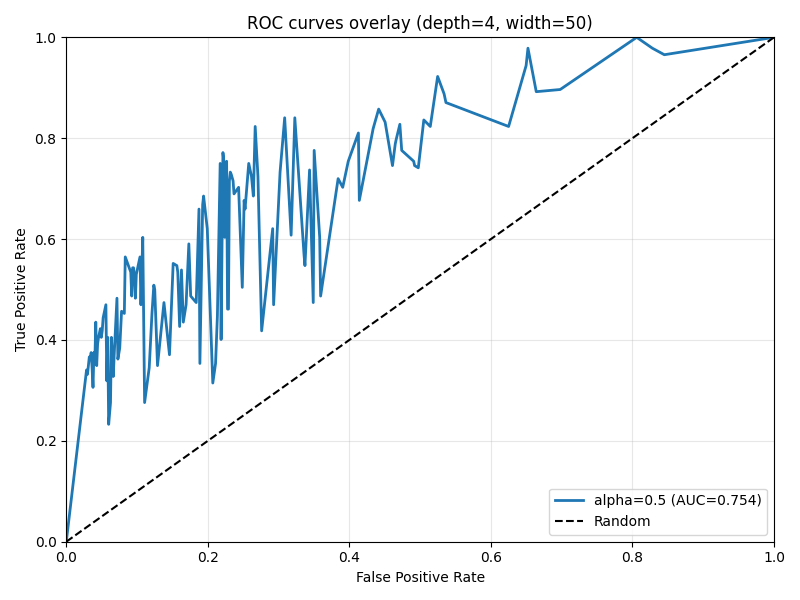

# pySubDisc

pySubDisc is a Python wrapper for [SubDisc: Subgroup Discovery](https://github.com/SubDisc/SubDisc).

## Installation

pySubDisc is available from PyPI. To install it, run:

```bash
python3 -m pip install pysubdisc
```

## Installation from source

To install pySubDisc from its sources, follow these steps:

* From https://github.com/SubDisc/SubDisc, use `mvn package` to build `target/subdisc-gui.jar`
* Place `subdisc-gui.jar` in `src/pysubdisc/jars`
* Run `pip install .` from the root directory of the repository (containing pyproject.toml)

## Example

Using the data from https://github.com/SubDisc/SubDisc/blob/main/adult.txt :

```python
import pysubdisc
import pandas

data = pandas.read_csv('adult.txt')
sd = pysubdisc.singleNominalTarget(data, 'target', 'gr50K')
sd.qualityMeasureMinimum = 0.25
sd.run()
print(sd.asDataFrame())
```

|    |   Depth |   Coverage |   Quality |   Target Share |   Positives |   p-Value | Conditions                            |
|---:|--------:|-----------:|----------:|---------------:|------------:|----------:|:--------------------------------------|
|  0 |       1 |        443 |  0.517601 |       0.440181 |         195 |       nan | marital-status = 'Married-civ-spouse' |
|  1 |       1 |        376 |  0.453305 |       0.446809 |         168 |       nan | relationship = 'Husband'              |
|  2 |       1 |        327 |  0.359959 |       0.428135 |         140 |       nan | education-num >= 11.0                 |
|  3 |       1 |        616 |  0.354077 |       0.334416 |         206 |       nan | age >= 33.0                           |
|  4 |       1 |        728 |  0.326105 |       0.311813 |         227 |       nan | age >= 29.0                           |
|  5 |       1 |        552 |  0.263425 |       0.317029 |         175 |       nan | education-num >= 10.0                 |

Some detailed examples can be found in the /examples folder.

## How to run (ROC experiments)

The repository includes an experiment driver that mines subgroups, builds ROC curves, and writes plots/tables for easy comparison across strategies.

Quick demo (runs a minimal example):

```powershell
python .\main.py
```

Full ROC sweep and strategy comparison (recommended):

```powershell
python .\experiments\roc_sweep.py --data .\tests\adult.txt --alphas 0.3 0.5 0.7 --depth 4 --width 50 --nr-threads 1 --no-postproc --strategies ROC_BEAM WIDE_BEAM BEAM BEST_FIRST --wide-width 200 --out .\runs\roc
```

Notes:
- Use `--nr-threads 1` and `--no-postproc` for more deterministic runs.
- WIDE_BEAM uses the BEAM engine with a larger width (`--wide-width`).
- You can change dataset via `--data`, beam `--width`, search `--depth`, and `--min-coverage`.
- Numeric handling can be tweaked with `--numeric-strategy` and `--nr-bins`.

Outputs (default `--out .\runs\roc`):
- `roc_overlay.png` — overlay of ROC curves.
- `table2_like_summary.csv` — per-alpha summary (ROC_BEAM), including AUC and TPR@FPR thresholds.
- `strategy_comparison.csv` — one table comparing strategies (ROC_BEAM, WIDE_BEAM, BEAM, BEST_FIRST).
- Per‑strategy folders with CSVs/PNGs, e.g.:
	- `ROC_BEAM/alpha_*/roc_points_alpha_*.csv`, `roc_alpha_*.png`, `roc_hull_alpha_*.png`
	- `WIDE_BEAM/alpha_*/...`, `BEAM/alpha_*/...`, `BEST_FIRST/alpha_*/...`

Examples of single‑alpha runs:

```powershell
# Single alpha, default BEAM width 50
python .\experiments\roc_sweep.py --data .\tests\adult.txt --alphas 0.5 --depth 4 --width 50 --nr-threads 1 --no-postproc --strategies ROC_BEAM WIDE_BEAM BEAM BEST_FIRST --wide-width 200 --out .\runs\roc

# Explore larger beam width for ROC_BEAM only
python .\experiments\roc_sweep.py --data .\tests\adult.txt --alphas 0.5 --depth 4 --width 100 --out .\runs\roc
```

## Example results (Adult dataset, alpha = 0.5)

Settings used for the comparison below:

- Data: `tests/adult.txt`
- Search: `--depth 4 --width 50`
- Determinism: `--nr-threads 1 --no-postproc`
- Strategies: `ROC_BEAM WIDE_BEAM BEAM BEST_FIRST` with `--wide-width 200`
- Output folder: `runs/roc`

Results summary (from `runs/roc/strategy_comparison.csv`):

| Strategy   | Alpha | Width used | Subgroups | AUC_env   | AUC_hull  | TPR@FPR<=0.05 | TPR@FPR<=0.10 | TPR@FPR<=0.20 | max_TPR  | min_FPR  |
|------------|:-----:|-----------:|----------:|----------:|----------:|--------------:|--------------:|--------------:|---------:|---------:|
| ROC_BEAM   | 0.5   | 50         | 204       | 0.7538922 | 0.8527299 | 0.4353448     | 0.5646552     | 0.6853448     | 1.000000 | 0.028646 |
| WIDE_BEAM  | 0.5   | 200        | 770       | 0.7973941 | 0.8264244 | 0.0000000     | 0.5732759     | 0.7327586     | 0.840517 | 0.070313 |
| BEAM       | 0.5   | 50         | 643       | 0.8003687 | 0.8262953 | 0.0000000     | 0.5646552     | 0.7112069     | 0.857759 | 0.055990 |
| BEST_FIRST | 0.5   | 50         | 830       | 0.8146299 | 0.8255236 | 0.0000000     | 0.5732759     | 0.7500000     | 0.840517 | 0.082031 |

Overlay plot of the ROC curves: 

## Documentation

The SubDisc documentation might be of help for working with pySubDisc: https://github.com/SubDisc/SubDisc/wiki.

### Data loading

pySubDisc uses `pandas.DataFrame` tables as input. There are two options to pass these from pySubDisc to SubDisc itself:

```python
data = pandas.read_csv('adult.txt')

# Either, create a SubgroupDiscovery target structure directly
sd = pysubdisc.singleNominalTarget(data, 'target', 'gr50K')

# Or, first load the dataframe into SubDisc for further preparation
table = pysubdisc.loadDataFrame(data)
sd = pysubdisc.singleNominalTarget(table, 'target', 'gr50K')
```

### Data preparation

A `pySubDisc.Table` object can be manipulated before creating a SubDisc target using the following functions:

```python
# Load a pandas.DataFrame object
table = pysubdisc.loadDataFrame(data)

# Describe the columns (name, type, cardinality, enabled)
print(table.describeColumns())

# Change column type to binary
table.makeColumnsBinary(['column', 'other_column']

# Change column type to numeric
table.makeColumnsNumeric(['column', 'other_column']

# Change column type to nominal
table.makeColumnsNominal(['column', 'other_column']

# Disable columns
table.disableColumns(['column', 'other_column']

# Enable columns
table.enableColumns(['column', 'other_column']

# Select a subset of the rows by passing a pandas boolean Series
table.setSelection(data['education'] == 'Bachelors')

# Reset selection of rows to the full data set
table.clearSelection()
```

### Configuring subgroup discovery

A `pySubDisc.SubgroupDiscovery` object can be created by the following target functions:

```python
# single nominal target
sd = pysubdisc.singleNominalTarget(data, targetColumn, targetValue)

# single numeric target
sd = pysubdisc.singleNumericTarget(data, targetColumn)

# double regression target
sd = pysubdisc.doubleRegressionTarget(data, primaryTargetColumn, secondaryTargetColumn)

# double correlation target
sd = pysubdisc.doubleCorrelationTarget(data, primaryTargetColumn, secondaryTargetColumn)

# double binary target
sd = pysubdisc.doubleBinaryTarget(data, primaryTargetColumn, secondaryTargetColumn)

# multi numeric target
sd = pysubdisc.multiNumericTarget(data, targetColumns)
```

After creating a `pySubDisc.SubgroupDiscovery` object, you can configure its search parameters. For example:

```python
print(sd.describeSearchParameters())

sd.numericStrategy = 'NUMERIC_BEST'
sd.qualityMeasure = 'RELATIVE_WRACC'
sd.qualityMeasureMinimum = 2
sd.searchDepth = 2
```

An appropriate value of the `qualityMeasure` option can in particular be computed for various target types using the `computeThreshold()` function.

```python
# If setAsMinimum is set to True, the qualityMeasureMinimum parameter is updated directly
threshold = sd.computeThreshold(significanceLevel=0.05, method='SWAP_RANDOMIZATION', amount=100, setAsMinimum=True)
```

### Running subgroup discovery

After configuring the search parameters, you can run the subgroup discovery process by calling the `run()` method.

```python
sd.run()
```

### Examining the results

```python
# The resulting subgroups are given as a pandas.DataFrame, with one row per subgroup
print(sd.asDataFrame())
```


The function `getSubgroupMembers()` returns a set of members of a subgroup as a pandas boolean Series.

```python
# Get rows corresponding to subgroup #0
subset = data[sd.getSubgroupMembers(0)]
```


For a number of the target types, a `showModel()` method is available to aid visualization of the discovered subgroups. The scripts in the `/examples` directory demonstrate its use.


The function `getPatternTeam()` returns a Pattern Team for the discovered subgroups.

```python
# if returnGrouping is True, getPatternTeam will also return
# the grouping of subgroups according to the pattern team
patternTeam, grouping = sd.getPatternTeam(3, returnGrouping=True)

print(patternTeam)

# print the subgroups for the first of the three determined groups
df = sd.asDataFrame()
print(df[grouping[0]])
```
